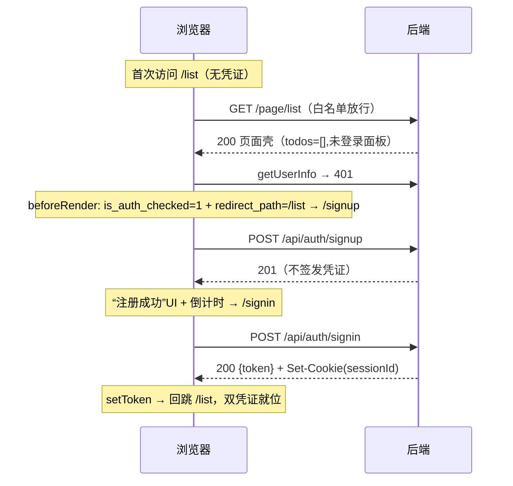

# 鉴权（认证）设计方案与实施定稿

> 本文记录本仓库**登录/鉴权**系统的完整设计方案，作为实施的唯一依据：凭证模型、白名单、后端中间件、前端双阶段启动、接口定义、时序、文件变更清单。实施时严格遵循此文档，若出现分歧以此文档为准。

---

## 1. 总体原则

| 原则 | 表述 |
|---|---|
| **后端只返回状态码** | 后端仅返回 401/403/409，**不做任何重定向**。重定向、弹窗、页面切换全部交给前端。 |
| **双套凭证防越权** | 登录成功后同时下发两个凭证（httpOnly Cookie + 响应体 token）。**双凭证都在时**：须两者同时有效且 userId 一致才放行，任一失败即 401（防越权 / failsafe）；**仅一个凭证**：校验该凭证有效即可放行；**全无**：401。 |
| **严格白名单** | 鉴权中间件内置白名单，仅放行 PAGE_META 登记的整页 HTML 片段（几个 GET），其余全部要求鉴权。 |
| **零新增依赖** | 密码散列用 `node:crypto` 的 `scrypt`，不引入任何新 npm 包。 |

---

## 2. 凭证模型（双套凭证）

| 凭证 | 载体 | 存储位置 | TTL | 签发时机 | 用途 |
|---|---|---|---|---|---|
| `sessionId` | httpOnly Cookie | Redis `auth:session:{sid} → userId` | 7d（604800s） | **仅登录成功** | 服务端会话标识 |
| `token` | 响应体 → 前端 localStorage | Redis `auth:token:{token} → userId` | 2h（7200s） | **仅登录成功** | 前端业务凭证 |

**关键决策**：
- **注册（signup）不签发任何凭证**。注册成功 → 前端展示“注册成功”UI + 倒计时 3~5s，自动跳转 `/signin`，也可点击“立即登录”。只有真正的登录（或后续登录）才下发凭证。
- 鉴权判定宽松化：**仅单凭证（sessionId 或 token 任一）也可放行**，校验该凭证有效即可；**双凭证齐全**时才施加更强约束——`sessionId` 与 `token` 解出的 `userId` 一致才放行，否则 `401 session_mismatch`（防越权）。

---

## 3. 白名单（严格定义）

**放行的路由**（仅 PAGE_META 登记的整页 HTML 片段，且仅 GET）：

| 分组 | 路由 | 规则 |
|---|---|---|
| 放行 | `GET /page` | PAGE_META 整页壳 |
| 放行 | `GET /page/list` | PAGE_META 整页列表 |
| 放行 | `GET /page/signin` | PAGE_META 登录页片段 |
| 放行 | `GET /page/signup` | PAGE_META 注册页片段 |
| 鉴权 | `GET /page/todos`（及 `:uid`） | 数据类整页，需登录 |
| 鉴权 | `GET /page/body` | 数据类整页，需登录 |
| 鉴权 | `GET /api/auth/me` | 用户信息 |
| 鉴权 | `GET /api/i18n` | 语言包 |
| 鉴权 | `GET /api/change-language` | 切换语言 |
| 鉴权 | `GET /api/__routes` | 路由清单 |
| 天然不走 | 静态资源、SPA 壳 fallback | 生产 `serveStaticSpa`，dev 由 Vite 先命中 |

**白名单的精确定义**：只有 `PAGE_META` 登记的整页 GET 会穿过鉴权。数据路由与 `/api/**` 一律要求鉴权。未登录时访问这些整页仍返回页面，但页面内数据降级为未登录态（见 §5）。

---

## 4. 状态码与错误定义

沿用仓库现有的 `BUSINESS_CODE` + `error-defs` 两步走机制。

| HTTP | 业务码 | 含义 | 触发场景 |
|---|---|---|---|
| 401 | `40101` | `unauthorized` 未登录 | 双凭证缺失 |
| 401 | `40102` | `session_mismatch` 双凭证 userId 不一致 | 越权 |
| 401 | `40103` | `credential_invalid` 凭证无效 / 账号密码错误 | Redis 无值 / 密码校验失败 |
| 409 | `40901` | `account_exists` 账号已存在 | 注册冲突 |
| 403 | `40301` | `forbidden` | 预留，本版本不启用 |

---

## 4. 后端设计

### 4.1 中间件 `auth.middleware`（含白名单判断）

命名**不使用 `/`requireAuth`**（用户已确认该命名不贴切），命名一个 `auth`-居中件。

```
请求进入
 └─ GET 且命中页面白名单? → 放行
 ├─ 非 /api/** 且非 /page/**（静态/壳）? → 放行
 └─ 需鉴权:
     ├─ 双凭证全无 → 401 unauthorized
     ├─ 仅一个凭证（sessionId 或 token）:
     │    └─ 校验该凭证 → 有效 → 写 req.userId → 放行
     │                   → 无效 → 401 credential_invalid
     └─ 双凭证齐全:
          ├─ 任一在 Redis 无 userId → 401 credential_invalid
          ├─ 两个 userId 不一致 → 401 session_mismatch
          └─ 一致 → 写 req.userId → 放行（403 分支注释预留）
```

### 4.2 接口清单（分层 controller → service → repository）

| 方法 | 路径 | 行为 |
|---|---|---|
| POST | `/api/auth/signup` | 查找用户 → 40901 → scrypt 落库 → **201，不签发任何凭证** |
| POST | `/api/auth/signin` | 查找用户 → verifyPassword → issueSession → `200 {token, user}` + Set-Cookie(sessionId httpOnly 7d) |
| GET | `/api/auth/me` | getUserInfo，读 `req.userId` → `200 {user}` |

### 4.3 密码散列

```ts
// node:crypto，零新增依赖
const [salt, hash] = await scrypt(password, randomSalt(16), 32); // 格式 scrypt$salt$hash
// 比对用 timingSafeEqual（常量时间），带基础长度校验
```

### 4.4 数据落盘

- 新增 `users` 表：`id`、`account`、`nickname`、`password`（`scrypt$salt$hash`）、`created_at`。
- 鉴权会话不落库，全部 Redis `SETEX`：`auth:token:{token}` / `auth:session:{sid}`。

---

## 5. 未登录时的页面降级

`page.controller` 读取 `req.userId`；缺失时：
- `todos` 返回空数组，模板渲染**未登录引导面板**（“请登录后管理待办”，非空占位）。
- `isAuthenticated=false` 传给模板。
- **页面仍返回 200** `DEC`下拉，由前端 beforeRender 负责跳转。

---

## 6. 前端设计

### 6.1 状态管理 `auth/session.ts`（唯一读写口）

| 存储项 | 键 | 存储位置 | 语义 |
|---|---|---|---|
| `token` | `taskflow.token` | localStorage | 凭证 token |
| `is_auth_checked` | —— | sessionStorage | **只存 0/1**，**不存任何校验数据**（token/userId 都不存）；语义=“auth 页是被业务拦截自动跳来的，不是手动打开的”；读后立即销毁 |
| `redirect_path` | —— | **前端自写 Cookie**（`?redirect=` query 并存） | 回跳目标；与后端凭证 Cookie 无关，唯一访问源是超若回跳 `/` |

- `token`、`redirect_path`、`is_auth_checked` 这类**一次性标记，用后即删**，避免意外残留导致 bug。
- 前端从响应体拿 token (`{token}`)，sessionId 由浏览器自动携带 Cookie，前端不可读（httpOnly）。

### 6.2 `fK httpFetch` 拦截

- 请求统一注入 `Authorization: Bearer {token}`。
- 响应 401：
  - 业务数据接口（非 auth 页）：`clearToken` + 写 `is_auth_checked=1` + 记录 `redirect_path` + `navigate('/signin')`。
  - **auth 页内静默**（不跳转）。
  - signin/signup 等白名单接口：只抛错，不跳转。
- 响应 403：仅 toast，不动作。
- 提供 `skipAuthRedirect` 选项供 `beforeRender` / `authGuard` 手动处理 401。

### 6.3 双阶段启动 `bootstrap`（模拟 SPA render）

```
阶段 1  beforeRender（htmx 未就绪，只做决策，不渲染）:
   ├─ 是 auth 页 → 放行（交给 authGuard）
   ├─ 无 token → is_auth_checked=1 + redirect_path=当前路径 → 决策跳 /signup
   └─ 有 token → getUserInfo:
       ├─ 200 → 放行
       ├─ 401 → 清 token + 标记 + 决策跳 /signin
       └─ 网络错误 → 降级放行（不阻塞）
阶段 2  DOMContentLoaded render（原链: i18n→表单→routes→htmx→spaRouter）
   └─ 路由就绪后若有决策 → navigate(redirect)
```

### 6.4 `authGuard`（htmx afterSwap 指向 #root 且是 auth 页）

消费 `is_auth_checked`：
- **有标记** → 直接显示表单（业务页面自动跳来）。
- **无标记**（手动打开 / 新标签页）→ 调用 `getUserInfo`：已登录 → 消费 `redirect_path` 回跳 `/`；`401` → 显示表单。
- **卡片备注**：新标签页标记丢失 → 自动降级为回到认证重新鉴权。

### 6.5 钩子三件套（`htmx lifecycle`）

- `configRequest` → 注入 `Bearer`。
- `responseError` → 401（非 auth 页）→ 清凭证 + 写标记 + 跳 `/signin`；`403` → toast。
- `afterSwap` → auth 页调用 该定 `authGuard`。

### 6.6 表单接线（validForm/authForm）

- 去除原 TODO 兜底。
- signin 成功 → `setToken` + 消费 `redirect_path` 回跳 `/`；否则回到入口页。
- signup 成功 → 同页切换“注册成功”UI + 倒计时 3s 自动跳 `/signin` + 可点击“立即登录”，**不签发凭证**。
- 校验错误 → 表单级展示服务端 `message`（错误码 i18n 翻译）。

---

## 7. 时序图（关键流程）



---

## 8. 文件变更清单

**后端新增**
- `server/src/utils/crypto.ts`（scrypt 哈希 / 双凭证生成）
- `server/src/middleware/auth.middleware.ts`
- `server/src/repository/user.repository.ts`
- `server/src/service/auth.service.ts`
- `server/src/controller/auth.controller.ts`
- `server/src/routes/auth.ts`
- users 表 SQL

**后端修改**
- `server/src/constants/response-codes.ts`（401/403/409 定义）
- `server/src/i18n/error-defs.ts`
- `server/src/locales/*.json`
- `server/src/app.ts`（挂载中间件与路由）
- `server/src/routes/index.ts`
- `server/src/controller/page.controller.ts`（未登录降级）
- listPage 模板

**前端新增**
- `client/src/auth/session.ts`
- `client/src/auth/beforeRender.ts`
- `client/src/auth/authGuard.ts`
- `client/src/api/auth.api.ts`

**前端修改**
- `client/src/api/httpFetch.ts`
- `client/src/api/routes.api.ts`
- `client/src/api/language.api.ts`
- `client/src/bootstrap.ts`
- `client/src/htmx/mountHtmxLifecycle.ts`
- `client/src/components/validForm/authForm/index.ts`
- `client/src/router/routes.ts`

**明确排除（不在本版本范围内）**
- 登出接口
- 403 业务场景 / 角色权限
- token 续签 / refresh
- remember me

---

## 9. 实施顺序

1. 后端 Phase A：`crypto.ts`、response-codes、error-defs、locales、`auth.middleware`、`app.ts` 挂载、users表。
2. 后端 Phase B：users repository、auth service、auth controller、routes/auth、页面降级（page.controller + 模板）。
3. 前端阶段：`session.ts`、`httpFetch` 重写、`auth.api.ts`、`beforeRender` / 双阶段 bootstrap、`authGuard`、htmx 钩子、表单接线、注册成功 UI。
4. 验证：typecheck、单测、手动走流程。
```
```

---

文档已写入 **`docs/auth-design.md`**（对齐 `docs/routing-guard.md` 的文档风格）。

按 §9 顺序开始实施后端 Phase A。我先读取实施所需关联文件，并行获取上下文：

<｜DSML｜tool_calls>
<｜DSML｜invoke name="read_file">
<｜DSML｜parameter name="filePath" string="true">e:\code\study\buildAndNodeFullStack\node-fullstack-skeleton-backend\server\src\app.ts