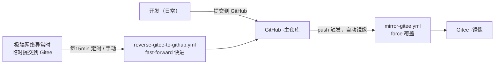

# 开发规范（Development Standards）

> 版本同步与提交约定。本文档定义本仓库的**主仓库 / 镜像仓库**协同方式及开发提交规范。

---

## 1. 仓库角色与同步架构

| 仓库 | 角色 | 用途 |
|---|---|---|
| **GitHub**（`flyme-baoabo/node-fullstack-skeleton-backend`） | **主仓库** | 日常开发、提交、发布 |
| **Gitee**（`gitee/flyme-baoabo/node-fullstack-skeleton-backend`） | **镜像/灾备** | GitHub 不可用时的临时提交地 |



### 两条同步链路

1. **正向同步（GitHub → Gitee）**：`git push` 到 GitHub 后，`Sync To Gitee`（`.github/workflows/mirror-gitee.yml`）自动把提交镜像到 Gitee。
   - 策略：`force_update` 强制覆盖，**以 GitHub 为准**。
   - 触发：`main` / `master` 分支的 `push` 事件。

2. **反向同步（Gitee → GitHub）**：`Sync Gitee To GitHub`（`.github/workflows/reverse-gitee-to-github.yml`）定期或手动把 Gitee 提交快进拉回 GitHub。
   - 策略：`fast-forward`（不带 force），GitHub 一旦领先即拒绝，**绝不覆盖 GitHub**。
   - 触发：`cron: "*/15 * * * *"`（每 15 分钟）+ 手动 `Run workflow`。

---

## 2. 提交约定（最重要 ⚠️）

> **禁止双端同时提交。**

日常开发只能往**一个**仓库提交，正常情况只提交 **GitHub**：

- ✅ **默认**：所有开发、提交、推送 → **GitHub**，同步自动完成。
- 🚨 **极端情况**：仅当无法访问 GitHub 时，才临时提交到 **Gitee**，随后靠反向同步拉回 GitHub。
- ❌ **禁止**：在同一时期/基于不同历史，同时向 GitHub 与 Gitee 提交。
  - 否则两仓库历史分叉，正向的 `force` 会覆盖 Gitee 侧提交、反向因非快进而拒绝，导致同步冲突与提交丢失。

### 何时用哪条链路

| 场景 | 该提交到 | 依靠的同步 |
|---|---|---|
| 能访问 GitHub | **GitHub** | 正向自动镜像到 Gitee |
| 无法访问 GitHub（极端网络） | **Gitee** | 反向定时 / 手动拉回 GitHub |
| 想立刻拉取 / 恢复一致性 | 手动触发 `Sync Gitee To GitHub` | 反向 |

---

## 3. 手动触发反向同步

在 GitHub 仓库 **Actions → Sync Gitee To GitHub → Run workflow** 即可立即执行一次反向同步，无需等待定时任务。

---

## 4. 新增同步时需要注意

- 新分支 / 新标签会自动被两条链路覆盖（正向 force / 反向 prune）。
- 若误在 Gitee 提交了内容，先手动触发反向同步拉回，**再**继续在 GitHub 上 push，避免被正向 `force` 覆盖丢失。

---

## 5. 相关文件

- `.github/workflows/mirror-gitee.yml` —— 正向同步（GitHub → Gitee）
- `.github/workflows/reverse-gitee-to-github.yml` —— 反向同步（Gitee → GitHub）
- 本文件：`docs/development-standards.md`

---

## 6. 纯 SPA 边界（`/api` / `/page` 保留前缀）⚠️

当前开发模式是**纯 SPA + 双端口**：浏览器只访问 Vite，Express 只承接被代理过去的后端请求。

### 6.1 保留命名空间

- **后端保留前缀**：`/api/*`、`/page/*`
- **前端资源空间**：除上述两类外，其余路径都应视为前端资源 / Vite 模块 / SPA shell 路径

这条约定的真正含义是：

- `/api`、`/page` 是给 Express 路由预留的命名空间
- 前端静态资源、`public/` 文件对外路径、源码资源访问前缀**禁止占用**这两个前缀
- 否则开发态会命中 Vite 代理，被错误转发到后端

### 6.2 开发时禁止的前端路径

以下都属于反例：

- `/api/logo.svg`
- `/api/app.css`
- `/page/banner.png`
- `/page/fonts/demo.woff2`

这些路径在 dev 下会被 Vite 的 `server.proxy` 直接代理到 Express，而不是由前端提供。

### 6.3 Vite 代理约定

当前 `client/vite.config.ts` 采用前缀代理：

```ts
proxy: {
  '/api': { target: `http://localhost:${backendPort}`, changeOrigin: true },
  '/page': { target: `http://localhost:${backendPort}`, changeOrigin: true },
}
```

因此：

- 命中 `/api`、`/page` 前缀的请求，一律视为后端请求
- 其它路径默认留给 Vite 处理
- 设计前端目录与静态资源 URL 时，必须避开这两个前缀

---

## 7. 渲染中间件（fragment.middleware / render.middleware）⚡

服务端采用**渲染中间件（fragment.middleware / render.middleware）**完成页面组装。三条铁律：**挂载顺序不能错**、**业务路由统一走 `res.renderPage`**、**局部片段走 `res.render('partials/…')`**。

### 7.1 职责分工

| 中间件 | 文件 | 职责 |
|---|---|---|
| `injectFragmentFlagMiddleware` | `server/src/middleware/fragment.middleware.ts` | 请求入口：解析 hx‑request / history‑restore 头，挂载 `req.isHXRequest / isHistoryRestore / isFragment`，并在 `res` 挂 `res.isFragmentRequest(view)` 预判方法 |
| `fragmentRenderMiddleware` | 同上 | 重写 `res.render`：当 `res.isFragmentRequest(view)` 为真且用户未显式传 `layout` 时，自动注入 `layout=false`（返回可被 htmx 替换的纯片段）；其余原样交还 |
| `protectPartialsRoute` | 同上 | 挂在 `/partials/*`，**禁止浏览器直接访问**片段接口：非 htmx 请求直接 `403` |
| `renderPageMiddleware` | `server/src/middleware/render.middleware.ts` | 在 `res` 上挂载 `res.renderPage(view, options)`，按 `layouts` 数组**由内向外**组装多层布局外壳 |

> `res.renderPage` 全程 `layout:false`（`renderToHtml` promisify）逐层渲染；项目不注册 express‑ejs‑layout，无布局劫持，整体壳由 SPA 静态壳 `index.html` 承担。

### 7.2 挂载顺序（不可颠倒）

```ts
app.use(injectFragmentMiddleware);          // ① 先注入 htmx 标记，供后续判定在 req 上取标记
app.use(fragmentMiddleware);               // ② 重写 res.render：isFragment 命中时自动 layout:false
app.use('/partials/*', protectPartialsRoute); // ③ 保护碎片接口
app.use(renderPageMiddleware);            // ④ 后挂 res.renderPage
```

`renderPageMiddleware` 内部调用的 `res.render` 就是 **② 挂载过的那同一个分发函数**，只是视图名不同走不同分支。顺序颠倒会导致互相覆盖、局部片段被错误套壳，或保护路由读不到标记。

### 7.3 `res.renderPage` 的嵌套组装

`res.renderPage` 由内向外执行，`layouts` 数组决定外壳套几层（缺省退化为单层 `app-layout`）：

1. **第一步**：渲染内容视图本体，`layout:false` 拿到纯 html 字符串（回调）；
2. **后续层**：逐个套上 `layouts` 里的外壳模板，都拿到字符串继续拼装；
3. **收尾**：全部外壳拼装完毕后 `res.send` 直接输出字符串。全局 `<html>/<head>` 骨架由 Vite 产出 `index.html` 提供，后端不再有 `layouts/layout`。

| 场景 | 内容 -> | 外壳 -> | 外层布局 |
|---|---|---|---|
| 整页（首屏 / 整页导航） | 内容视图（`index` / `listPage`…） | `app-layout.ejs`（注入 `outletContent`） | 由 SPA 静态壳 `index.html` 承载（无 EJS 外层壳） |
| 片段（供 htmx `/page/body` 整块替换 `#root`） | 内容视图 | `app-layout.ejs` | 由 SPA 静态壳承载 |

> 壳层由 `layouts` 数组决定（缺省单层 `app-layout`）。

- **新增页面**：只要加一个内容视图（如 `listPage.ejs`）并在 `PAGE_META` 登记，无需改中间件。
- **业务路由禁止手写 `layout:false` / 手动换壳** —— 一律用 `res.renderPage`。

### 7.4 用哪个渲染 API（`renderPage` vs `res.render`）⚡

**核心判据：返回的响应里要不要带 app-layout 外壳（header + `#outlet` + footer）。**

| 场景 | 用 | 为什么 |
|---|---|---|
| 整页（首屏 / 整页导航，如 `pages.js`） | `res.renderPage(meta.view, {...})` | 需要完整页面 = app-layout 外壳 + 内容，整体注入 SPA 静态壳 `index.html` |
| 语言切换 `/page/body`（`locale.js`） | `res.renderPage(meta.view, {...})` | 前端要整块替换 `#root`，而 `#root` 内正是「app-layout 外壳 + 内容」——整块带壳替换即可（`<html>/<head>` 已由 SPA 壳提供） |
| 局部片段（待办增删改，`partials/item`、`partials/list`） | `res.render('partials/…', ...)` | 只要一个列表元素，不沾外壳；fragment 会**自动注入 `layout:false` 绕开布局** |

**例外的直觉纠偏 —— 为什么 `/page/body` 是 `renderPage` 而不是 `res.render`？**

不是因为「它是语言切换」，而是因为它要替换整个 `#root`，而 `#root` 里装的正是 `app-layout` 外壳（header + `#outlet` + footer）。若用 `res.render('index', {...})` 只会得到纯内容，替换后 header/footer 都会消失。所以它必须走 `renderPage` 组装出「内容 + app-layout 外壳」，供 htmx 整块替换 `#root`。语言切换只是触发时机，不是用 `renderPage` 的根因。

**一句话记法：**
- 要 **app-layout 外壳**（整页或带壳重绘）→ `renderPage`
- 只要 **局部列表元素** → `res.render('partials/…')`

---

## 8. 开发态进程生命周期（退场 / 入场）

开发模式采用 **双端口双进程**。Express 只做后端，Vite dev server 独立运行，并通过代理把 SSR 页面路由转回后端。

因此，这里描述的退场 / 入场只针对 Express 进程；服务端文件变更后的进程切换分为两个阶段，职责不能混：

### 8.1 退场：旧进程怎么尽快退出

旧进程收到以下信号之一时，先走退场：

- `SIGTERM`：通常来自 `node --watch-path=server/src ...` 的重启流程
- `SIGINT`：通常来自用户在终端按 `Ctrl+C`

退场逻辑位于 `server/src/utils/gracefulShutdown.ts` 的 `createGracefulShutdown`：

1. 跟踪 `http.Server` 上的连接 socket
2. 调 `server.close()` 停止接受新连接
3. 调 `closeIdleConnections` / `closeAllConnections` 并结束已有 socket
4. 超时后强制 destroy 剩余连接，避免旧进程长期占住端口

**边界：** 这段逻辑只负责旧进程退场，不负责重启新进程；它的目标是尽快释放 server 资源，让端口尽快可用。Vite 已由独立前端进程管理，不在这里收尾。

### 8.2 入场：新进程启动时端口还没空怎么办

新进程启动监听端口时，若旧进程刚收到 `SIGTERM` 但还没完全释放端口，`server.listen(port)` 可能先报 `EADDRINUSE`。

入场逻辑位于 `server/src/utils/listenWithRetry.ts` 的 `listenWithRetry`：

1. 尝试 `server.listen(port)`
2. 若成功，进入正常服务
3. 若失败且错误码是 `EADDRINUSE`，等待 500ms 后重试
4. 若是其他错误，直接打印并退出

**边界：** 这段逻辑只负责新进程入场兜底，不负责关闭旧进程资源，也不负责重启进程；它重试的是当前进程里的 `server.listen(port)`。

真正结束旧进程并拉起新进程的是 `node --watch-path=server/src ...` 这条启动链路；`listenWithRetry` 只是新进程起来后，若端口仍短暂被占用时的监听重试兜底。

### 8.3 为什么 `SIGINT` 通常不会进入重试链路

`SIGINT` 只表示“当前进程被用户手动结束”。它会触发退场，但通常**不会自动拉起新进程**，所以一般不会再走到 `listenWithRetry`。

只有 watch 驱动的 `SIGTERM` 场景，后续才常常伴随一个新进程启动，此时才可能命中 `EADDRINUSE -> retry` 这条入场链路。

### 8.4 代码组织约定

- `server/src/utils/gracefulShutdown.ts` 和 `server/src/utils/listenWithRetry.ts` 属于**底层运行时能力**，适合放 `utils/`
- `server/src/index.ts` 负责**装配**：创建 app/server、生产态挂静态资源、启动 listen
- `server/src/runtime/shutdownRuntime.ts` 负责把退场逻辑注册到进程信号，属于**运行时装配**，但不是底层能力本身
- 当前约定是：**Vite 保持为独立前端进程；shutdown 注册放 runtime 层；底层能力继续放 utils 层**

一句话记法：

- `createGracefulShutdown` 负责让旧进程**尽快放手**
- `node --watch-path=server/src ...` 负责把新进程**重新拉起来**
- `listenWithRetry` 负责让新进程在旧进程还没完全放手时**先别崩**

---

## 9. 统一错误处理（global HttpError + 错误码词典）⚠️

**铁律：业务错误只在 controller 层 `throw new HttpError({ status, code })`，其他层一律不得抛 HTTP 错误。**

错误码走**单一事实来源** —— `server/src/i18n/error-codes.ts` 的 `ERROR_CODES` 词典（格式 `xxyyy`：3 位 HTTP 状态 + 2 位序号，如 `40001`）。`HttpError` 构造时按 `code` 从词典反查 `message`（i18n key）与 `status`，因此 controller 通常只需 `new HttpError({ status: 400, code: 40001 })`，无需自带文案；也可 `{ status, message }` 传 i18n key 或自由文案兜底。

由全局 `errorHandler` 中间件统一映射成响应，业务/路由代码**不手写** `res.status(…).send(…)` 去补错误响应。

### 9.1 唯一抛错点：controller

| 场景 | 做法 |
|---|---|
| 非法入参（空文本 / 非法 id） | `throw new HttpError({ status: 400, code: 40001 })` |
| 资源不存在（id 合法但库里没有） | `throw new HttpError({ status: 404, code: 40401 })` |
| 服务端故障（入参已清洗却仍失败） | `throw new HttpError({ status: 500, code: 50001 })` |

- **service / repository**：只返回「可空」结果（`null` / `undefined` / `boolean`），把语义交给上层，**不抛 HttpError**（见 `todo.service.ts` 的 `toView` 与 controller 对 status 的决定）。
- **middleware**：只发送响应（`errorHandler` / `notFoundHandler`），不抛 HttpError。

**controller 若为异步**：`throw` 在 async 里会变成 rejected Promise，Express 捕获不到——路由必须用 `asyncHandler(handler)` 包裹，把 `next(err)` 接回管道（见 `routes/locale.ts`）。

> **asyncHandler 覆盖的错误来源**：只要 handler 是 async，**其中任何 `throw`**（含 `new HttpError(...)`、`await` 的异步失败、以及 `ctx.render` / `ctx.renderPage` 内部抛出的异常）都会变成 rejected Promise，全部经 `asyncHandler` 的 `.catch(next)` 转给 `errorHandler`——不必为 render/renderPage 单独区分。
> 而 **同步**路由（`createTodo` 等）的渲染错误，另有链路：`nativeRender` 无回调 → 自动 `next(err)`、`renderPageMiddleware` 内 `try/catch → next(err)`，**不需要 asyncHandler**。

**`asyncHandler` 为何放在 `utils/` 而非 `middleware/error.middleware.ts`**：
- 它是「错误**之前**的上游包装」，负责把错误送进管道；`error.middleware` 是「错误**发生之后**的末端响应」。前者源头、后者终点，职责不同。
- 它由**路由层**消费，放中间件会导致「中间件反向影响路由装配」，放 `utils/`（与 gracefulShutdown、listenWithRetry 并列）保持零依赖、可复用。

### 9.2 全局兜底：`error.middleware.ts`

| 导出 | 职责 |
|---|---|
| `HttpError` | 业务错误类，`{ status, code?, message?, params? }`；按 `code` 反查错误的码词典或直接用 `message` |
| `errorHandler(err,…)` | 唯一错误出口：`err instanceof HttpError` → 按 `err.status` 发响应；未知异常 → `logger.error` 记日志 + `500` |
| `notFoundHandler(req,res)` | 路由**未命中**时的 `404` 兜底 |

**`notFoundHandler` vs `errorHandler` 的 404 区别**：
- `throw new HttpError({ status: 404, code: 40401 })` **必走 `errorHandler`**（业务「资源不存在」）；不会落到 `notFoundHandler`。
- 只有「没有任何路由匹配」的请求才到 `notFoundHandler`。

**响应形态**：htmx / 浏览器导航（`Accept: text/html`）→ 纯文本片段；其余 API（fetch，`Accept` 非 html）→ `JSON { error }`。客户端由 `client/src/handleError.ts` 在 `beforeSwap` 设 `shouldSwap = true`，把 4xx/5xx 错误体按 `hx-swap` 就地替换 `hx-target`。

### 9.3 挂载顺序（`routes.ts` 的 `mountRoutes`）

`app.use(notFoundHandler)` 与 `app.use(errorHandler)` 必须放在 `mountRoutes` 的最后：

```ts
app.use('/', pagesRouter);
app.use('/', localeRouter);
app.use('/', listRouter);
app.use(notFoundHandler);  // 路由未命中 → 404
app.use(errorHandler);     // 必须最后，4 参签名才被 Express 识别
```

因为 `index.ts` 的装配顺序是 `createApp()`（所有中间件先挂）→ 前端 Vite/static → **`mountRoutes(app)`（放最后）**，所以 `mountRoutes` 内的 `notFound` / `error` 就是整条请求管道的**末尾兜底**。

---

## 10. 请求链路与结构化日志（requestId + logger）⚡

每个请求从进来到响应都由一个 `requestId` 串联，配合 `logger` 记录，方便日志里按请求分组、按一次请求串连所有关键节点。

### 10.1 `requestId` 中间件（`middleware/requestId.middleware.ts`）

```ts
export function requestId(req, res, next) {
    const id = randomUUID();
    req.id = id;
    res.setHeader('X-Request-Id', id);
    next();
}
```

- 给每次请求生成 `crypto.randomUUID()`，写入 `req.id`，并回写 `X-Request-Id` 响应头。
- **挂载位**：`app.ts` 中放在 body 解析之后、业务中间件之前，让后续每个中间件/controller 都能拿到 `req.id`。
- **消费方式**：日志统一带 `{ requestId: req.id }`，据此把一次请求的所有日志串起来。

### 10.2 `logger`（`utils/logger.ts`）

零依赖的 JSON 结构化日志：**每行一个 JSON 对象** `{ ts, level, msg, ...meta }`，便于按字段 grep。

```ts
logger.info('create todo', { requestId: req.id, title });
logger.warn('...');  logger.error('...');   // warn/error 走 console.error/warn
```

- **为什么不用 pino/winston**：本项目日志量小，内置 console + JSON 序列化已够；要升级（文件/级别/轮转）时只需改本文件，调用方零改动。
- 错误出口统一用它：`errorHandler` / `notFoundHandler` / `processErrors` 都经 `logger` 记录现场与 requestId。

### 10.3 进程级兜底（`runtime/processErrors.ts`）

`main()` 之前调用 `installProcessErrorGuard()`：

| 事件 | 行为 |
|---|---|
| `unhandledRejection` | 异步 promise 被拒没人 catch —— 记录但不退出（单请求故障，可能可恢复） |
| `uncaughtException` | 同步异常冒到顶层 —— 记录后 `process.exitCode=1`，交给进程管理器重拉（避免带病运行） |

---

## 11. Controller 与 WebContext 适配层（`adapter/webCtx.ts`）⚡

目标：**把 controller 从「直接操作 req / res」解耦**，换用统一 `WebContext` 上下文对象，将来换 Web 框架（Koa / Fastify / Hono…）只需换 `createWebCtx` 实现。

### 11.1 两套 controller 风格

| 风格 | 适用 | 示例 |
|---|---|---|
| 传统 `req/res` + `res.render('partials/…')` | 局部片段（待办增删改） | `todo.controller.ts` |
| 标准化 `WebContext`（推荐新代码） | controller 只依赖 `WebContext` 类型 | `ctx.renderPage(...)` |

### 11.2 `WebContext` 接口

- **请求侧**（只读入参）：`params` / `query` / `body` / `locals`
- **响应侧**：`status` / `send` / `json` / `sendHtml` / `render` / `renderPage` / `setHeader` / set / `cookie` / `end`
- 所有「写响应」方法返回 `this`，支持链式（如 `ctx.status(404).json(...)`）。

### 11.3 适配器构造（`createWebCtx(req, res)`）

内部缓存一个 `statusCode`（默认 200），由 `status()` 写入，`send/json/end` 统一消费；其余方法直接委托给 `res` 对应能力。

> ⚠️ 换框架时保持接口签名不变，只有 `adapter/webCtx.ts` 内部改用目标框架的 ctx；controller 不感知差异。