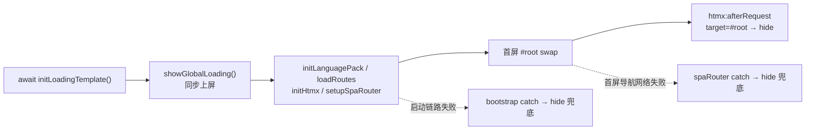

# 请求 Loading 方案（Request Loading）

> 本文记录本仓库**请求期 Loading** 的完整设计：一套骨架、两种形态（全局视口遮罩 / DOM 区域遮罩），以及各自的接入方式、生命周期与边界约束。代码主入口：`client/src/components/loading.ts`。

---

## 1. 目标与场景

| 场景 | 阶段 | 需求 | 形态 |
|---|---|---|---|
| 应用启动 | bootstrap 首屏：语言包 / 路由清单 / htmx 加载完成、`#root` 换入内容前 | **启动期间必须覆盖全视口**（产品需求：整屏 Loading 反馈，不是挂在某个局部容器上的装饰） | **全局视口遮罩**（JS 驱动） |
| 局部刷新 | 如 `/list` 手动刷新按钮、表单提交回填 | 只需遮住发起刷新的 DOM 区域，页面其余部分保持可交互外观 | **DOM 区域遮罩**（纯 CSS，零 JS） |

设计原则：

- **一套骨架复用**：两形态共用同一份 `client/src/templates/loading.html`（spinner + 文案），注册于 `templates.ts` 的 `TEMPLATE_FILE_BY_ID`（Vite `import.meta.glob('./*.html', {query:'?raw'})` 自动打成懒加载 chunk）。
- **组件样式不包含尺寸**：`.loading-spinner` 只定义形状/动画，不设 width/height，尺寸由父级决定（全局 `h-8 w-8`、区域 `h-6 w-6`）。
- **可访问性**：全局遮罩 `role="status" aria-busy="true"`；区域遮罩 `aria-hidden="true"`（装饰性）。
- **遮罩底色统一在 `.loading-overlay` 类**：半透明白底只写在 `loading.scss` 这一个类里，两形态模板只挂类名，不在模板上叠加背景色工具类。**统一不加 backdrop blur**：启动期页面近乎全白，blur 无内容可糊；且全视口 `backdrop-filter` 在 spinner 每帧动画下都是纯 GPU 开销。

---

## 2. 形态一：全局视口遮罩（JS 驱动）

### 2.1 API（`client/src/components/loading.ts`）

三个函数全部**幂等**，任意时机安全调用：

| 方法 | 签名 | 职责 |
|---|---|---|
| `initLoadingTemplate` | `(): Promise<void>` | 预载模板并缓存克隆元素。`templateReady ??=` 缓存同一份 Promise，重复调用只加载一次；失败仅 `console.error` 并保持不可用，**不阻断启动** |
| `showGlobalLoading` | `(): void` | **同步上屏**：从缓存克隆一份 append 到 `body`，无内部 await；已显示时跳过；模板未就绪/预载失败时为无操作 |
| `hideGlobalLoading` | `(): void` | 移除遮罩并清空引用；未显示时为无操作 |

文案策略：`show` 时若 i18n 已回填则覆写为 `t('common.loading')`；启动初期语言包未就绪（`t()` 兜底返回 key 本身）则沿用模板内置文案，避免把 key 露给用户。

层级：`z-[70]`，高于 toast（`z-[60]`）——启动失败时错误 toast 能正常浮出遮罩之上。

### 2.2 启动时序（`client/src/bootstrap.ts`）



> 预载与后续模块加载串行执行，总启动时长不变；拆成「先 await 预载、再同步 show」是为了让上屏动作无内部网络等待。

### 2.3 关闭点（三处，全部幂等）

| 关闭点 | 位置 | 覆盖情况 |
|---|---|---|
| `htmx:afterRequest` 且 `detail.target?.id === ROOT_ID` | `mountHtmxLifecycle.ts` | 正常收尾：成功 / 204 / 304 / 4xx / 5xx 都触发 |
| `bootstrap` catch | `bootstrap.ts` | 启动链路任一步失败 |
| `spaRouter` catch（`loadPageByPath`） | `spaRouter.ts` | **纯网络失败兜底**：htmx 2.x 在 sendError 路径下 `afterRequest` 的 `detail.target` 为空，不会命中第一处 |

---

## 3. 形态二：DOM 区域遮罩（纯 CSS，零 JS）

### 3.1 原理

htmx 对**触发请求的元素**会自动加/摘 `.htmx-request` 类（源码 `addRequestIndicatorClasses`：`hx-indicator` 未配置时目标就是触发元素自身；配置了则用其解析结果）。区域遮罩完全建立在这条机制上：

1. 容器加 `.loading-region` 类（`position: relative`）；
2. 容器内放一个 `.loading-overlay`（默认 `display: none`）；
3. 触发元素 `hx-indicator` 指向该容器（或不写，让 `.htmx-request` 落在触发元素自身）；
4. `loading.scss` 规则 `.loading-region.htmx-request > .loading-overlay` 在请求期间显出遮罩（恢复 `display: flex` + `absolute` 铺满容器 + 半透明白 + 居中 spinner + `z-index: 10`；不加 backdrop blur）。

全程无 JS 参与，请求结束 htmx 自动摘类、遮罩自动隐藏。

### 3.2 现有接入：`/list` 刷新按钮（`server/src/views/pages/listPage.ejs`）

```html
<button class="btn-ghost" hx-get="/page/todos" hx-target="#todo-list" hx-swap="outerHTML"
    hx-indicator="#todo-list-region" hx-disabled-elt="this">↻ 刷新</button>

<div class="loading-region rounded-xl border border-gray-100 p-2 sm:p-3" id="todo-list-region">
    <%- include('../partials/list', { todos }) %>
    <%- include('../partials/loading') %>
</div>
```

**关键约束：容器不能是 swap 目标。**按钮/form 的 `hx-target` 必须指向容器内部（此处为内层 `#todo-list`）——若容器自身被 `outerHTML` 替换，遮罩节点会随之消失，下一轮请求就没有遮罩了。

`hx-disabled-elt="this"`：请求期间禁用按钮防连点。`this` 只在触发元素**自身支持 `disabled` 属性**时可用（button 可以，form 不行）。

### 3.3 接入：表单（form 特有写法）

form 触发时若不写 `hx-indicator`，`.htmx-request` 会加在 **form 自身**上，因此最简方案是 form 自身当遮罩容器，连 `hx-indicator` 都不用写：

```html
<form class="loading-region mb-5 flex ..." hx-post="/page/todos" hx-target="#todo-list" hx-swap="afterbegin" ...>
    <input ... />
    <button type="submit" ...>添加</button>
    <%- include('../partials/loading') %>
</form>
```

- form **不是** swap 目标（`hx-target` 指向外部/内部的 `#todo-list`），遮罩不会被换掉，没有 3.2 的约束；
- 禁用表单控件必须用 `find` 前缀：`hx-disabled-elt="find input, find button"`。
  - ❌ `this`：解析为 form 自身，HTML 不支持 `<form disabled>`，设了也无效；
  - ❌ 裸选择器 `input, button`：htmx 对不带前缀的选择器走 `getRootNode(elt).querySelectorAll(...)`，是 **document 级查询**，会禁掉全页所有 input/button；
  - ✅ `find input, find button`：限定从 form 内部向下查找。请求结束 htmx 只恢复自己加的 `data-disabled-by-htmx`，不影响用户原有的 disabled 状态。

### 3.4 遮罩节点统一 partial（`server/src/views/partials/loading.ejs`）

区域遮罩的唯一骨架写点（服务端复用，与全局遮罩的 `loading.html` 模板机制解耦——SSR 片段里无法用前端懒加载模板）：

```ejs
<div class="loading-overlay" aria-hidden="true">
    <span class="loading-spinner <%= locals.size || 'h-6 w-6' %>"></span>
</div>
```

- 可选参数 `size`：spinner 尺寸工具类，默认 `h-6 w-6`；传法 `include('../partials/loading', { size: 'h-8 w-8' })`；
- `.loading-region` 容器仍需手写在业务模板上（它承载布局/圆角/边框，属于页面结构，不抽）。

### 3.5 新场景接入清单

任意局部元素加 loading，三步：

1. 容器：加 `.loading-region` 类（可带任意 id / 布局类）；
2. 容器内：`<%- include('../partials/loading') %>`（需要更大 spinner 时传 `size`）；
3. 触发元素：`hx-indicator="#容器id"`（若容器就是触发元素自身，如 form，可省略）。

注意点：

- 容器不能是 swap 目标（除非 swap 方式不会移除容器）；
- `.loading-region` 要求自身有定位上下文（`position: relative` 已由组件样式提供），遮罩 `inset: 0` 随容器尺寸铺满，`border-radius: inherit` 跟随容器圆角；
- 一次请求只能指向一个 indicator 值，但多个触发元素（如刷新按钮 + form）可共用同一容器。

---

## 4. 相关文件索引

| 文件 | 职责 |
|---|---|
| `client/src/templates/loading.html` | 骨架模板（全局遮罩用，区域遮罩直接写在 EJS 里） |
| `client/src/templates/templates.ts` | `loading-template` 注册 |
| `client/src/components/loading.ts` | 全局遮罩 API（init / show / hide） |
| `client/src/bootstrap.ts` | 启动第 0 步：预载 + 同步 show |
| `client/src/htmx/mountHtmxLifecycle.ts` | `afterRequest` target=`#root` 关闭点 |
| `client/src/router/spaRouter.ts` | 纯网络失败兜底关闭点 |
| `client/src/components/loading.scss` | `.loading-spinner` / `.loading-region` / `.loading-overlay` 样式 |
| `server/src/views/partials/loading.ejs` | 区域遮罩骨架 partial（`size` 可选参数） |
| `server/src/views/pages/listPage.ejs` | 区域遮罩示例（刷新按钮 + form 两处接入） |
| `server/src/locales/zh-CN.json` · `en-US.json` | `common.loading` 文案 |

## 5. 验证方式（实测记录）

- 构建：`npm run build:client` 通过，loading 模板 / 组件为独立懒加载 chunk，样式产物含全部 loading 规则。
- 浏览器实测（CDP `Network.emulateNetworkConditions` 拖慢网络采样）：
  - 全局遮罩：启动期 `display: flex` 出现 → 首屏 swap 后由 `afterRequest` 移除 → 列表正常换入；
  - 区域遮罩：刷新中 `flex`（遮罩随容器尺寸）+ 按钮禁用 → 完成后复位、列表换入，容器与遮罩节点在 swap 后保留。
- 约束回归：零延迟下全局遮罩存活仅几十毫秒，属正常现象（遮罩只为慢启动兜底，快路径一闪而过）。
