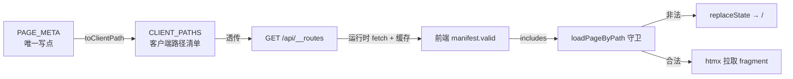
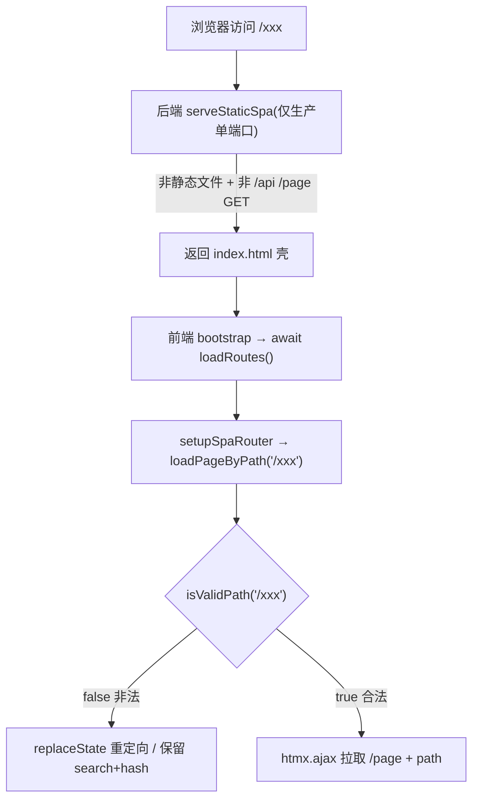

# 路径路由守卫方案（Path Router Guard）

> 本文记录本仓库**纯路径路由守卫**（SPA 端的访问控制前置）的完整设计：目标、数据流、实现、边界，以及它**与未来「Redis 鉴权重定向」的职责分工**。

---

## 1. 目标与范围

目前在纯 SPA 模式下，浏览器地址栏路径与后端路由是**两套命名空间**：

| 命名空间 | 示例 | 属主 |
|---|---|---|
| 浏览器可见路径 | `/`、`/list` | 前端 SPA 地址栏 |
| 后端内部路由 | `/page`、`/page/list` | Express `mountRoutes` |

**本方案守卫的内容**：只校验**浏览器路径是否在合法集合内**。不涉及任何认证 / 权限 / 登录态判断。

- 合法路径：`/`、`/list`（仅这两页）
- 非法路径（如 `/xxx`）：**重定向到基路径 `/`**（保留 `search` + `hash`）
- 例外：非 `/page`、`/api` 前缀的静态类请求由后端 `serveStaticSpa` 兜底返回壳，合法性判定下沉到前端。

---

## 2. 单一数据来源（Source of Truth）

**后端 `server/src/views.ts` 的 `PAGE_META` 是唯一写点。**新增/删页只需改它，其余全自动跟随：

```
PAGE_META.keys（/page, /page/list）
  └─ toClientPath()  去 /page 前缀 + 去尾部斜杠 + 兜底 '/'
       └─ CLIENT_PATHS（['/','/list']，浏览器可见合法路径）
            └─ /api/__routes 清单接口 → JSON { valid, base }
```

全链路依赖链（单一来源原则）：



**关键决策**：前端**不硬编码**第二份路径表，也不 `import` 后端源码；运行时拉 JSON，保证前后端源码独立。同样，`/api/__routes` 的 `valid` **直接返回 `CLIENT_PATHS`**（已是归一后的客户端路径），前端再做归一属于重复实现，已移除。

---

## 3. 两侧归一化（谁负责哪一段）

`toClientPath`（后端）与 `normalize`（前端）**不是重复，是各管一段**——作用对象不同：

| | 输入 | 处理 | 输出 |
|---|---|---|---|
| 后端 `toClientPath` | `PAGE_META` 的 key（带 `/page`） | 去 `/page` 前缀 | `'/'`、`'/list'` |
| 前端 `normalize` | 实时导航 path（如 `/list/`、`/list?a=1#x`） | `new URL().pathname` + 去尾部斜杠 | 与清单同形态 |

- 后端把内部路径**变成**客户端路径；
- 前端把**待判路径**（可能带 search/hash、尾部斜杠）归一到同形态再 `includes` 比对。

> `normalize` 用 `new URL(path, window.location.origin)` 取 `.pathname`，天然丢弃 `search`/`hash`。这是建立在**输入源于同源**的信任边界之上（点击已过同源检测、popstate 走本地 history），属于合理设定。

---

## 4. 前后端两层分工

后端 `serveStaticSpa` 与前端守卫**各自权责不同**，非重复防御：



- **后端** `serveStaticSpa`：只判断「是不是静态资源」。不是文件也不是后端接口，则兜底返回 SPA 壳。**不判路由合法性**（后端没有前端路由表）。
- **前端** `loadPageByPath`：真正持有 `manifest`，**判定是否合法**，非法 `replaceState → /`。

> 开发（Vite 双端口）不走 `serveStaticSpa`，但 `/xxx` 由 Vite 返回 SPA 壳后，前端守卫逻辑一致，行为相同。

---

## 5. 相关文件

| 文件 | 角色 |
|---|---|
| `server/src/views.ts` | `PAGE_META`（唯一写点）、`toClientPath`、`CLIENT_PATHS` |
| `server/src/routes/routes-manifest.ts` | 派生 `valid`，暴露 `GET /api/__routes` |
| `server/src/routes/index.ts` | `mountRoutes` 挂载 `routesManifestRouter` |
| `server/src/middleware/staticSpa.middleware.ts` | 生产静态 + SPA 深链兜底（不判合法性） |
| `client/src/router/routes.ts` | `loadRoutes()`、`isValidPath()`、`normalize()` |
| `client/src/router/spaRouter.ts` | `loadPageByPath` 开头守卫 + `replaceState` |
| `client/src/bootstrap.ts` | `setupSpaRouter` 前 `await loadRoutes()` 预热 |

---

## 6. 与未来「鉴权重定向」的职责边界 ⚠️

本方案是**纯路径守卫（path guard）**。未来接入 **Redis 鉴权**后，属于**另一套重定向**，**不要混入本文件 / 本守卫**：

| | 现有（路径守卫） | 未来（鉴权守卫） |
|---|---|---|
| 判定依据 | 浏览器路径是否在 `CLIENT_PATHS` | 用户**登录态**（Redis session）是否有效 |
| 触发条件 | 访问非法路径 | 未登录访问受保护页（`/list` 等） |
| 跳转目标 | 重定向到 `/`（基路径） | **未登录 → `/signin`/`/signup`（登录入口）** |
| 跳转方向 | 无登录/登出流程（不涉及） | **登录成功 → 重定向回「之前的原路由」** |
| 数据源 | `PAGE_META`（静态） | Redis session + 受保护路由表 |

**两套守卫是叠加关系，不是替代**：
1. **先路径守卫**：路径非法 → 回 `/`（本方案）。
2. **再鉴权守卫**：路径合法但需登录 → 未登录则跳 `/signin`，并**记录回跳地址**（原路由），登录成功后 `redirect` 回原路由。

> 届时「鉴权守卫」应另起文档（如 `docs/auth-guard.md`），本文件只沉淀「路径守卫」，避免两种重定向逻辑耦合。